# Service walkthrough

Core diagrams reviewed against `staging` commit [`b1de421c461d59473b3bb73aae103027afd67a89`](https://github.com/miphu2804/smart-ledger/tree/b1de421c461d59473b3bb73aae103027afd67a89) on 2026-10-06. AI diagrams are outside this review and remain unchanged.
These are reading notes, not a source of truth — scope and behavior stay in `docs/product/` and `docs/contracts/`.

| Folder | Diagrams |
|---|---|
| `01-overview/` | request resolution, core services |
| `02-access/` | shop access guard, auth session |
| `03-sales/` | draft/sale/debt states, draft validation, checkout confirm |
| `04-money/` | idempotency, debt repay, sale void |
| `05-report/` | report summary |
| `06-ai/` | AI components, chat turn |

Colors: blue = step, yellow = decision / open state, red = error / terminal failure, green = start, success or final state, purple = data store, orange = shared service. Each group box has its own tint.

Re-render after editing this file: `./export.sh` (SVG, lossless zoom).

## 1. Request Resolution Logic

Every business request follows one path: Firebase auth → controller → service → shop ownership check → repository.

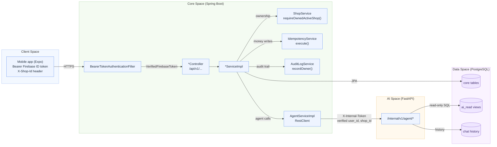

## 2. Core Service Interfaces

Every public method takes `VerifiedFirebaseToken` + `shopId` (`X-Shop-Id`) and calls `requireOwnedActiveShop` first — except `AuthSessionService` and some `ShopService` methods.

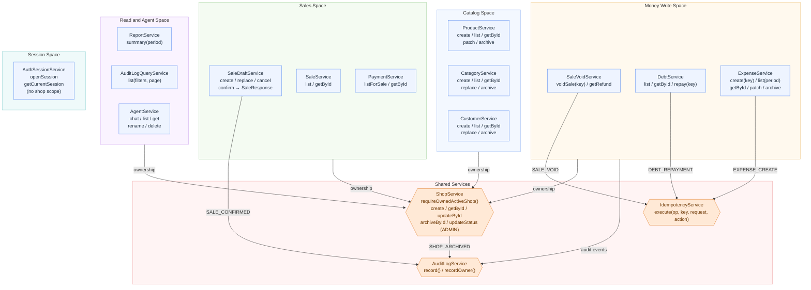

## 3. Shop Access Guard — `requireOwnedActiveShop`

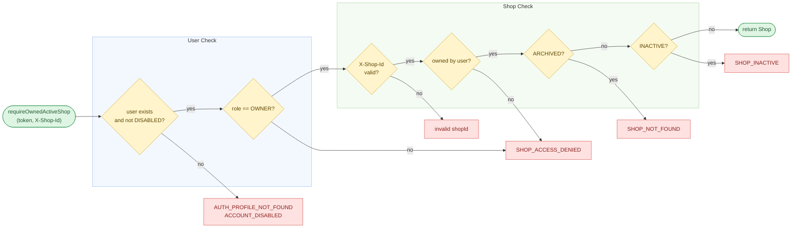

## 4. Auth Session — `openSession`

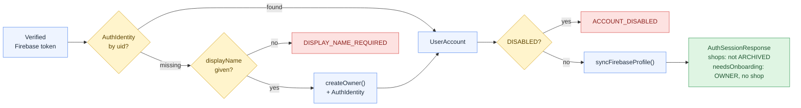

## 5. Sale lifecycle — draft → sale → payment / debt

### 5.1 State machines

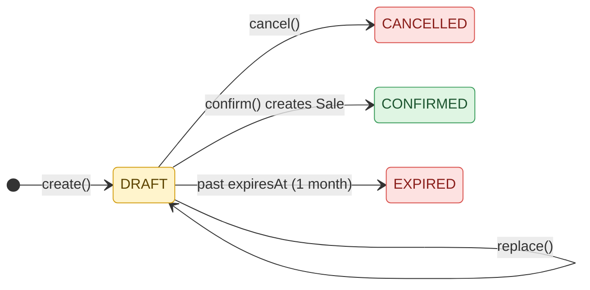

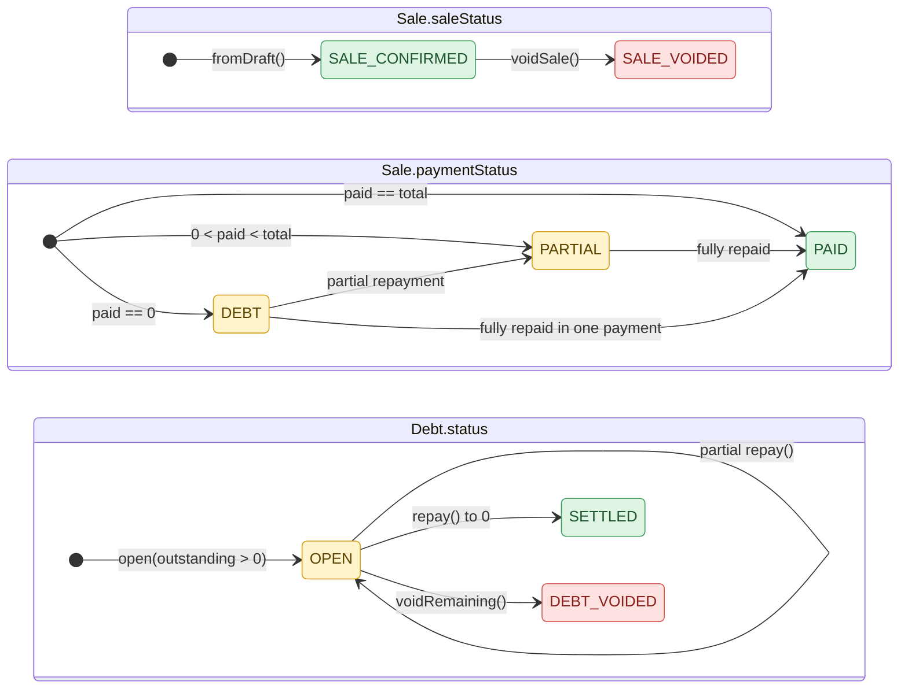

### 5.2 `SaleDraftService.create / replace` — validation (`prepare`)

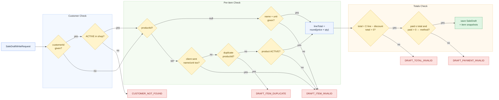

### 5.3 `SaleDraftService.confirm` — checkout

```mermaid
flowchart LR
    S(["confirm(draftId)"]) --> LOCK["lock SaleDraft"]

    subgraph Guard["Draft Guard"]
        REP{"already<br/>CONFIRMED?"}
        ED{"DRAFT and<br/>not expired?"}
    end

    subgraph Cust["Customer for Debt"]
        CU{"paid < total?"}
        CN{"customer<br/>source?"}
        NEWC["Customer.create()"]
    end

    subgraph Stock["Totals and Stock"]
        CHK["re-check<br/>Σ line − discount == total"]
        STK["lock products by id asc<br/>deductStock() if tracked"]
    end

    subgraph Persist["Persist"]
        SALE["Sale.fromDraft()<br/>+ SaleItems"]
        P1{"initialPaid > 0?"}
        PAY["Payment.initial()"]
        D1{"initialPaid < total?"}
        DEBT["Debt.open()"]
        DONE["draft.confirm(saleId)<br/>audit SALE_CONFIRMED"]
    end

    LOCK --> REP
    REP -->|yes| RET(["return existing Sale"])
    REP -->|no| ED -->|yes| CU
    ED -->|no| X1["DRAFT_NOT_EDITABLE"]
    CU -->|yes| CN
    CU -->|no| CHK
    CN -->|active id| CHK
    CN -->|name only| NEWC --> CHK
    CN -->|none| X2["CUSTOMER_REQUIRED_FOR_DEBT<br/>CUSTOMER_NOT_FOUND"]
    CHK --> STK --> SALE --> P1
    STK -.->|"short stock"| X3["PRODUCT_STOCK_INSUFFICIENT"]
    P1 -->|yes| PAY --> D1
    P1 -->|no| D1
    D1 -->|yes| DEBT --> DONE
    D1 -->|no| DONE
    classDef default fill:#eef4ff,stroke:#5b8def,color:#1f2d3d
    classDef decision fill:#fff4cc,stroke:#d4a017,color:#5c4400
    classDef error fill:#fde2e1,stroke:#d9534f,color:#8a1f1b
    classDef terminal fill:#dff5e3,stroke:#3c9d5d,color:#1e5631
    classDef store fill:#efe6ff,stroke:#8a63d2,color:#3d2a6b
    classDef shared fill:#ffe9d6,stroke:#e07b24,color:#6b3500
    class REP,ED,CU,CN,P1,D1 decision
    class X1,X2,X3 error
    class S,RET,DONE terminal
    style Guard fill:#f3f8ff,stroke:#9dbcf5
    style Cust fill:#f4fbf2,stroke:#a8d5a2
    style Stock fill:#fff9ee,stroke:#f0c987
    style Persist fill:#faf3ff,stroke:#cfa8f0
```

## 6. Money writes with idempotency

### 6.1 `IdempotencyService.execute`

Runs inside the caller's transaction (`Propagation.MANDATORY`).

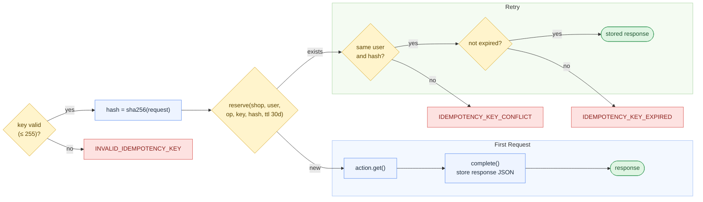

### 6.2 `DebtService.repay`

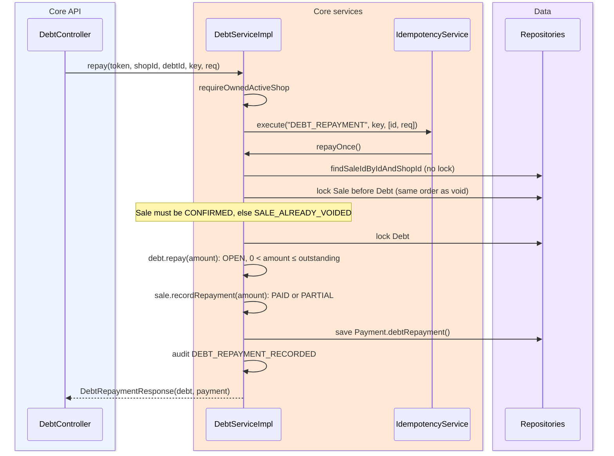

### 6.3 `SaleVoidService.voidSale`

Shared lock order for every money flow: **Sale → Debt → Product (ascending id)**.

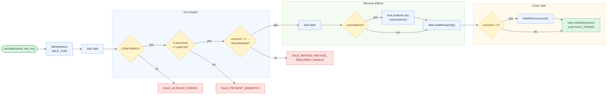

## 7. Report — `ReportService.summary(period)`

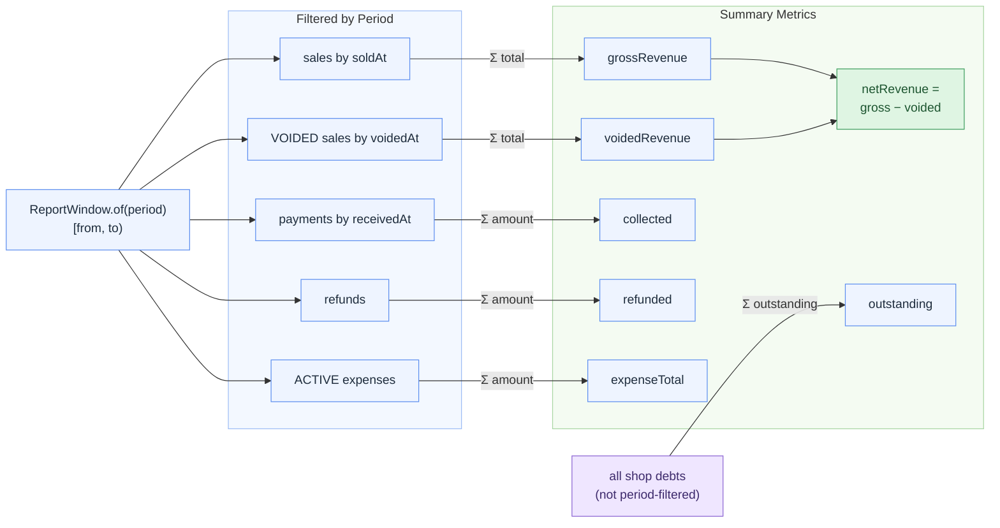

## 8. AI service

### 8.1 Components (composition root: `main.lifespan`)

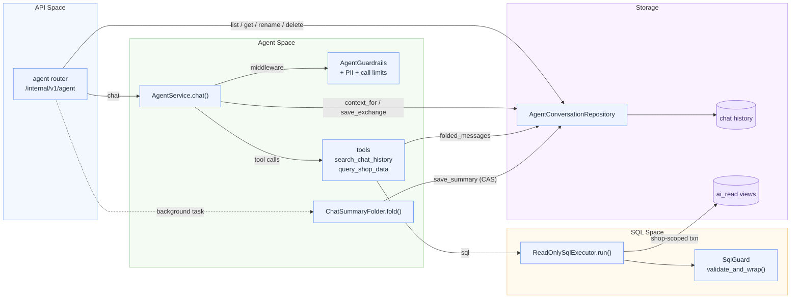

### 8.2 One chat turn end-to-end

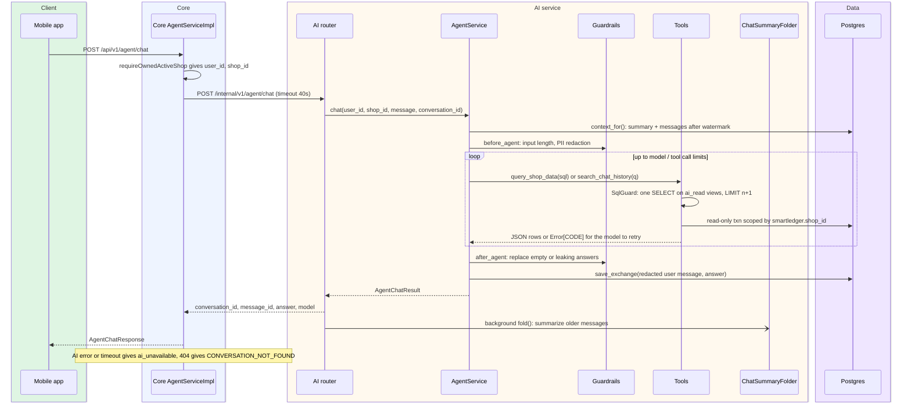
