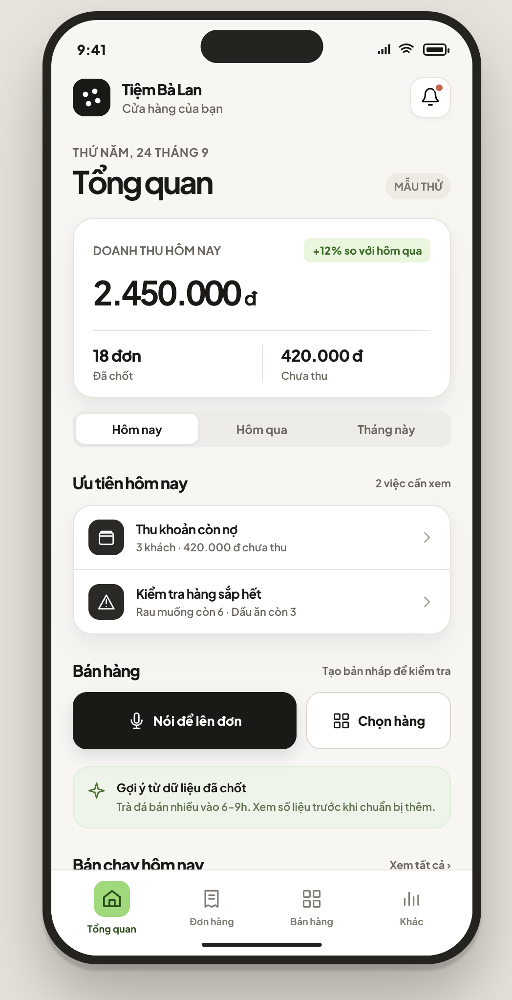

# Đề xuất style và lộ trình chuyển giao diện mobile

**Trạng thái:** quyết định visual cho nhánh `feat/mobile-minimal-ui`, ngày 2026-09-24; chưa phải bộ nhận diện production đã duyệt. Tài liệu này chỉ định hướng giao diện `OWNER`; yêu cầu sản phẩm và tiêu chí nghiệm thu vẫn nằm trong [BRD](../product/business-requirements.md) và [PRD](../product/product-requirements.md).

## Nguồn và mức độ chắc chắn

| Nguồn | Đã kiểm chứng từ file | Cách dùng |
|---|---|---|
| [Admin design brief tại `b6e7100`](https://github.com/miphu2804/smart-ledger/blob/b6e7100f2820eeff5670ab06e3dfb5d601ccf4e0/frontend/DESIGN.md) và [CSS của admin](https://github.com/miphu2804/smart-ledger/blob/b6e7100f2820eeff5670ab06e3dfb5d601ccf4e0/frontend/src/index.css) | Nền xám ấm, thẻ trắng có viền mảnh, Plus Jakarta Sans, điểm nhấn xanh lá, bóng rất nhẹ. Brief tự ghi chỉ khóa cho prototype, không phải nguồn chuẩn brand/pháp lý. | Lấy nhịp chữ, độ cô đọng, màu và chiều sâu; không sao chép bố cục desktop hay nội dung Elera/clinic trong ảnh tham chiếu. |
| [Theme mobile tại `0bd5ada`](https://github.com/miphu2804/smart-ledger/blob/0bd5ada83ccafb620ff25161313a3d4ea1adc732/frontend/mobile/src/theme.ts) | Mobile đang dùng xanh `#2858D8`, nền lạnh `#F3F6FD`, bóng có sắc xanh; đã dùng Plus Jakarta Sans. | Baseline kỹ thuật để thay token dần, giữ lại font và luồng nghiệp vụ đang có. `staging` hiện chưa chứa app mobile này. |
| `/tmp/smartledger-mobile-style-preview.html` | Đã đọc CSS/JS của bản xem thử: màu ấm, thẻ doanh thu, tab đáy, Zen ring kéo thả, menu và voice mô phỏng. File nằm ngoài repo, có thể mất. | Mẫu tương tác và shadow để thảo luận; **chưa** xác minh trực quan trên thiết bị hoặc tích hợp microphone/AI. |
| Ảnh mobile cũ và ảnh admin do người dùng gửi trong cuộc trò chuyện | Tham chiếu thị giác và nhận xét rằng mobile cũ nhiều mảng màu, ô chức năng lớn; admin có chữ và bóng dễ chịu hơn. | Căn hướng thiết kế, không coi nội dung ảnh là yêu cầu sản phẩm. |

**Hướng đề xuất:** một bề mặt nền ấm; thẻ trắng và ranh giới mảnh để nhóm nội dung; chỉ dùng xanh lá cho trạng thái chọn/khẳng định và một hành động chính. Dùng bóng để phân tầng thật (thẻ chính, điều khiển nổi, menu nổi), không đổ bóng dưới mọi hàng, chip và biểu tượng. Mobile vẫn cần luồng đọc một cột, vùng chạm đủ lớn và vùng an toàn hệ điều hành.

## Quyết định visual cho nhánh `feat/mobile-minimal-ui`

Ảnh là tham chiếu về **thứ bậc, khoảng trắng, hình khối và cảm giác màu**; tên tiệm, ngày, tiền, số đơn, phần trăm tăng trưởng và gợi ý trong ảnh không phải yêu cầu dữ liệu. Không đưa viền điện thoại, Dynamic Island hoặc status bar giả vào app. Giữ trạng thái mock/demo hiển thị rõ ở bản hiện tại; không gọi dữ liệu mẫu là dữ liệu thật.

- **Nền và chữ:** màn sáng trung tính `#F7F6F2` hoặc trắng khi cần mặt đọc thoáng; card trắng, viền `#E8E4DC`, chữ chính `#1A1916`, chữ phụ `#6B675E`. Tránh mảng xanh dương/tím và gradient trang trí. Chỉ dùng xanh lá cho tab được chọn, trạng thái tích cực và gợi ý được chứng minh bằng dữ liệu; cảnh báo/nợ giữ màu ngữ nghĩa riêng.
- **Nhịp Home:** hàng đầu gồm nhận diện tiệm và thông báo; tiếp theo ngày và tiêu đề `Tổng quan`; một card doanh thu là điểm nhấn lớn nhất. Bộ chọn `Hôm nay / Hôm qua / Tháng này` nằm ngay sau card như ảnh, đổi cả nhãn kỳ và số liệu trên card. Sau đó là tối đa hai việc cần xử lý theo dữ liệu hiện có, hai đường bán hàng (`Nói để lên đơn`, `Chọn hàng`), một gợi ý có nguồn/kỳ dữ liệu rõ, rồi danh sách bán chạy. Không giữ lưới chức năng lớn, không để chart và nhiều KPI tranh vị trí với hành động chính trên Home; báo cáo chi tiết vẫn truy cập được.
- **Ngữ nghĩa số liệu:** doanh thu và số đơn lấy từ đơn đã chốt của kỳ được chọn; chưa có dữ liệu thì hiện `Chưa có đơn trong kỳ`, không tự điền số trong ảnh. Nợ toàn tiệm phải ghi rõ `Còn nợ toàn tiệm`; chỉ ghi `Chưa thu trong kỳ` nếu tính từ đúng các đơn của kỳ. Phần trăm so sánh chỉ xuất hiện khi có mẫu kỳ trước hợp lệ. Lãi và chi phí giữ nhãn `ước tính` theo PRD.
- **Điều hướng:** 4 tab đáy có nhãn `Tổng quan`, `Đơn hàng`, `Bán hàng`, `Khác`. `Bán hàng` mở chọn hàng/POS; voice luôn có CTA riêng trên Home và đường vào tương đương trong khu `Khác`. Chi phí, công nợ và hàng hoá vẫn có đường vào trực tiếp từ nội dung/Home hoặc `Khác`. Không dùng nút tròn nổi ở giữa tab bar của UI cũ. Zen ring trong phần dưới của tài liệu là đề xuất cho giai đoạn tích hợp AI thật; bản mock hiện tại không thêm thao tác kéo/giữ giả hoặc waveform giả làm người dùng tưởng mic đang hoạt động.
- **Tương tác và kích thước:** Plus Jakarta Sans hiện có; tiêu đề Home 30–32, tiêu đề khu 20–22, số doanh thu 30–34, body 14–16, meta ít nhất 12. Card bo 18–20, điều khiển bo 12–14; khoảng cách nền 8/16/24. Tab, icon button, hàng có thể bấm và CTA có vùng chạm ít nhất 44 × 44. Dùng viền/spacing cho danh sách, bóng chỉ ở card doanh thu và CTA chính. Trên bề ngang 320–430, chữ số tiền và nút không bị cắt; cỡ chữ hệ thống lớn vẫn cuộn và bấm được.
- **Trạng thái và phạm vi:** UI mock phải nhận diện rõ demo. Gợi ý chỉ lấy từ số liệu đã chốt hiện có, có kỳ/phạm vi hoặc trạng thái thiếu dữ liệu; bỏ insight hard-code không kiểm chứng. Bỏ entry `Nhân viên` vì `FR-012` ngoài MVP; không quảng bá gói nâng cấp hoặc máy in trong `Khác` vì PRD mục 9 đặt ngoài MVP. Giữ route prototype hiện có, không sửa Core, auth, lưu trữ, tính tiền, hoặc API trong đợt restyle.

Nghiệm thu visual của nhánh: Home render đúng thứ bậc trên web mobile 320–430px; mọi CTA và tab đi đúng luồng cũ; các màn còn lại dùng cùng token, card/viền/chữ có thứ bậc nhất quán; trạng thái trống và mock được ghi rõ. Nghiệm thu hành vi chỉ xác nhận luồng app mock hiện có, không thay cho AC của tích hợp backend/voice thật.

## Bảng màu

Các giá trị dưới đây là **token tham chiếu đã kiểm chứng từ admin**, chưa được phê duyệt thành brand. Màu trạng thái giữ ý nghĩa riêng, không dùng để tô màu tùy ý cho từng ô chức năng.

| Vai trò | Màu | Dùng cho |
|---|---|---|
| `canvas` / `line` | `#E8E4DC` | Nền ngoài, đường phân cách mảnh |
| `frame` | `#F7F6F2` | Nền màn hình mobile |
| `card` | `#FFFFFF` | Thẻ nội dung, menu |
| `text` | `#1A1916` | Chữ chính, nút chính nền tối |
| `text-2` | `#6B675E` | Mô tả, nhãn phụ |
| `text-3` | `#9A958A` | Meta ít quan trọng; phải kiểm tra tương phản trước khi dùng cho chữ nhỏ |
| `accent` / hover | `#8FDB6E` / `#7CC85C` | Tab đang chọn, điểm nhấn tích cực |
| `accent-ink` | `#16350C` | Chữ/icon trên nền accent |
| `icon-well` | `#2A2926` | Nền icon vuông tối, dùng có chọn lọc |
| Green chip | `#E7F6DC` / `#2F6B1F` | Tích cực, hoàn tất |
| Blue chip | `#E4F0FF` / `#2157A4` | Thông tin trung tính |
| Amber chip | `#F8E9C8` / `#8A5A12` | Cần chú ý |
| Red chip | `#F8D9D4` / `#9B2C1F` | Lỗi/cảnh báo quan trọng |
| Gray chip | `#EEEBE4` / `#5C5850` | Trạng thái không nhấn mạnh |

**Sai khác đang thử ở preview:** Zen ring tối `#292824`, banner insight `#EDF4E8`/`#516C48`, chữ phụ nhạt `#928E86`. Ưu tiên token admin cho phần dùng chung; chỉ giữ sai khác sau khi so ảnh thật và kiểm tra tương phản. Không đưa bóng của khung điện thoại giả trong HTML vào app.

## Chữ, hình khối và thứ bậc

- **Đã kiểm chứng:** admin dùng Plus Jakarta Sans, tiêu đề tracking hẹp, số KPI semibold; mobile hiện đã nạp cùng font. Chữ chính gần đen và phụ xám ấm. Nút chính tối hoặc xanh lá, nút phụ trắng có viền. Thẻ admin bo khoảng `16px` với viền `1px #E8E4DC`.
- **Đề xuất cho mobile:** tiêu đề màn hình khoảng `22–24px`, mục `16–18px`, số doanh thu `28–32px`, body ít nhất `14px`, nhãn/meta ít nhất `12px`. Dùng chữ số tabular cho tiền và canh đơn vị `đ` rõ ràng. Khoảng cách cơ sở `8px`; padding thẻ khoảng `16–20px`; góc thẻ `16–20px`, nút `12–14px`, chip hình viên thuốc khi cần.
- Preview hiện có nhiều nhãn `10–11px`: xem đây là điểm cần sửa trước khi chuyển sang app. Kiểm tra cỡ chữ hệ thống lớn, độ tương phản và vùng chạm tối thiểu khoảng `44 × 44px` trên thiết bị.

## Bóng đổ theo component

Các thông số là **CSS của preview đã kiểm chứng**, dùng làm mục tiêu cảm giác chiều sâu. Admin gốc chủ yếu dùng viền và gần như không có bóng. Với React Native, phải chỉnh `shadowColor`, `shadowOpacity`, `shadowRadius`, `shadowOffset` trên iOS và `elevation` trên Android sau khi so thiết bị; không chép chuỗi CSS vào native.

| Component / tầng | Shadow CSS tham chiếu | Quy tắc |
|---|---|---|
| Thẻ chính: doanh thu, danh sách việc, analytics, card chat | `0 1px 3px rgba(42,41,38,.025), 0 8px 18px rgba(42,41,38,.045)` | Bóng mềm rất nhẹ **kèm** viền `1px #E8E4DC`; một nhóm nội dung là một bề mặt, không nâng từng dòng. |
| Thẻ doanh thu khi hover trên web preview | `0 2px 5px rgba(42,41,38,.04), 0 12px 24px rgba(42,41,38,.065)` | Chỉ là phản hồi pointer trên web; mobile dùng trạng thái nhấn thay vì hover. |
| Nút icon đơn lẻ | `0 1px 3px rgba(42,41,38,.035)` | Rất nhẹ; viền vẫn là tín hiệu chính. |
| Nút CTA chính | `0 5px 12px rgba(26,25,22,.10)` | Chỉ cho hành động nổi bật của màn hình. |
| Zen ring đang nghỉ | `0 5px 16px rgba(26,25,22,.19), 0 12px 26px rgba(26,25,22,.13)` | Nổi rõ hơn nội dung để nhận ra có thể kéo; vẫn không che tab và CTA. |
| Zen ring đang kéo | `0 9px 26px rgba(26,25,22,.23)` | Tăng tầng tạm thời; trở lại bóng nghỉ sau khi thả. |
| Menu từ Zen ring | `0 16px 35px rgba(26,25,22,.17)` | Tầng cao nhất trong luồng chọn AI; vị trí bị giới hạn trong vùng nhìn thấy. |
| Bubble gợi ý của ring | `0 2px 7px rgba(42,41,38,.05)` | Dùng ngắn gọn, có thể ẩn khi cản nội dung. |
| Orb trong voice mode | `0 0 0 12px rgba(143,219,110,.12), 0 0 0 26px rgba(143,219,110,.055)` | Đây là **halo trạng thái**, không phải bóng độ cao. Chỉ chuyển động theo mức âm thanh khi có tín hiệu mic thật; preview đang mô phỏng bằng CSS. |
| Tab đáy, chip, từng hàng, banner insight | Không shadow | Dùng nền/viền/khoảng trắng; tránh cảm giác mọi thứ đều là card nổi. |

## Bố cục và tương tác mẫu

### Trang chủ và doanh thu

Đặt bộ chọn kỳ `Hôm nay / Hôm qua / Tháng này` ngay sau **một thẻ doanh thu bo góc**, theo ảnh tham chiếu của nhánh này. Thẻ đổi nhãn và số theo kỳ đã chọn; hiện rõ doanh thu từ đơn đã chốt trong kỳ, số đơn, và công nợ/chưa thu chỉ khi nhãn nói đúng phạm vi dữ liệu. Chạm thẻ mở danh sách/báo cáo hiện có với kỳ đã chọn khi route hỗ trợ; không hứa dashboard analytics chưa tồn tại. Không trộn “doanh thu”, “đã thu” và “còn nợ” trong cùng một con số. Nếu thiếu dữ liệu, hiển thị trạng thái trống rõ nghĩa, không dùng số mẫu như dữ liệu thật. Cơ sở yêu cầu: [`BR-004`](../product/business-requirements.md), [`FR-004`, `FR-006`, `AC-004`](../product/product-requirements.md).

Sau thẻ tổng quan: việc cần xử lý và cảnh báo có ưu tiên; một CTA bán hàng rõ; danh sách ngắn các số liệu/mặt hàng liên quan. Bỏ lưới 2×2 icon lớn nếu nó làm đẩy việc chính xuống dưới màn hình. Mục “Nhân viên” của mock mobile cũ lệch với [`FR-012` đã loại khỏi MVP](../product/product-requirements.md); cần giải quyết khi migrate, không tự biến tài liệu này thành thay đổi phạm vi.

### Điều hướng và Zen ring (đề xuất sau bản mock)

Nhánh này giữ **4 tab đáy** theo quyết định visual phía trên. Zen ring là đề xuất cho giai đoạn AI thật: entry kéo thả được, đi theo các tab cấp cao như AssistiveTouch; chạm mở menu `Voice` / `Agent chat` / các tùy chọn thực sự có trong phạm vi; nhấn giữ khoảng `500ms` vào thẳng voice mode. Sau khi kéo, ring tự nằm trong vùng an toàn, không che điều khiển; menu và bubble đổi hướng nếu sát mép. Ẩn hoặc dời ring khi bàn phím, modal xác nhận, checkout hay màn hình con khiến nó che thao tác quan trọng. Cung cấp nhãn accessibility và đường vào Voice/Chat tương đương cho người không kéo/thao tác giữ được.

Voice mode ưu tiên màn hình tập trung, có nút đóng rõ ràng, chỉ báo đang nghe/đang xử lý/không nghe được và waveform theo input thực. Voice phục vụ lập đơn, ghi chi và hỏi đáp phù hợp phạm vi; output lên **bản nháp để sửa/xác nhận**, không tự ghi sổ. Nếu AI lỗi hoặc timeout, giữ input và cho chuyển sang text/POS. Đây là hướng tương tác đề xuất dựa trên [`FR-008`, `FR-020`, `FR-021`, `NFR-006`, `AC-008`, `AC-010`, `AC-011`](../product/product-requirements.md), chưa phải hành vi đã chạy trong app.

## Kế hoạch migration sang app mobile

| Bước | Thay đổi nhỏ nhất có thể review | Điều kiện kiểm tra trước khi qua bước tiếp |
|---|---|---|
| 0. Chốt baseline | Nhánh này tách từ `origin/feat/mobile-firebase-auth` vì `staging` chưa có app mobile; ghi luồng Home, báo cáo, điều hướng, voice trước khi sửa và đối chiếu PRD/AC. | Có baseline hành vi; không đè thay đổi người khác. |
| 1. Token | Đổi màu nền/chữ/viền/semantic và các mức bóng tại `frontend/mobile/src/theme.ts`; giữ Plus Jakarta Sans. Tạo mapping token cũ → mới cho component đang dùng; kiểm tra tương phản trước khi bỏ màu cũ. | Các màn hiện tại vẫn render, chữ đọc được, semantic warning/error không đổi ý nghĩa. |
| 2. Home và component dùng lại | Chuyển Home sang thẻ doanh thu, nhóm việc và CTA; gom style thẻ/nút/chip/tab thật sự lặp lại, không tạo thư viện mới chỉ vì một màn. Tách dữ liệu mẫu khỏi số liệu thật bằng nhãn rõ ràng. | Kỳ báo cáo, số đơn, doanh thu và nợ được gọi đúng tên; các luồng bán hàng cũ vẫn mở được. |
| 3. Zen ring và AI (giai đoạn sau) | Chỉ cân nhắc ring, thao tác kéo/giữ và waveform khi có quyền mic và pipeline xử lý thật. Bản migration mock dùng CTA rõ ràng và gắn nhãn demo cho câu mẫu. | Chưa nằm trong nghiệm thu nhánh UI này. |
| 4. Màn còn lại | Chuyển từng màn bán hàng, lịch sử, chi phí, công nợ, sản phẩm, báo cáo sang token mới; giữ route, phép tính, xác nhận và trạng thái rỗng/lỗi. Loại entry nhân viên khỏi bản MVP sau khi rà nguồn hiện hành. | So trước/sau theo từng luồng, không đổi nghiệp vụ chỉ vì restyle. |
| 5. Nghiệm thu | So web mobile ở `320–430px`, kiểm tra tương phản, vùng chạm, các CTA và đường điều hướng mock; iOS/Android, font scale và các AC tích hợp chỉ nghiệm thu khi có thiết bị và backend. | Có bằng chứng runtime cho luồng mock; ghi riêng các kiểm tra chưa chạy. |

**Chưa kiểm chứng:** thời điểm tích hợp nhánh vào `staging`; mức màu/shadow thực tế và font scale trên iOS/Android; quyền microphone và waveform phản ứng với âm lượng thật trong giai đoạn AI sau. Prototype HTML chỉ chứng minh ý tưởng bố cục/tương tác, không chứng minh các tích hợp đó.
