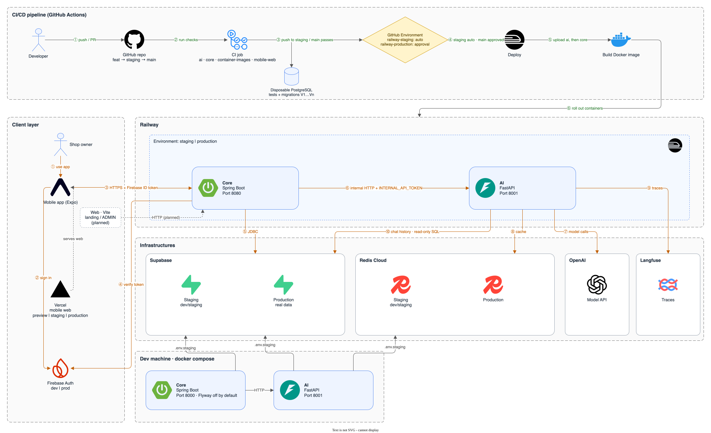
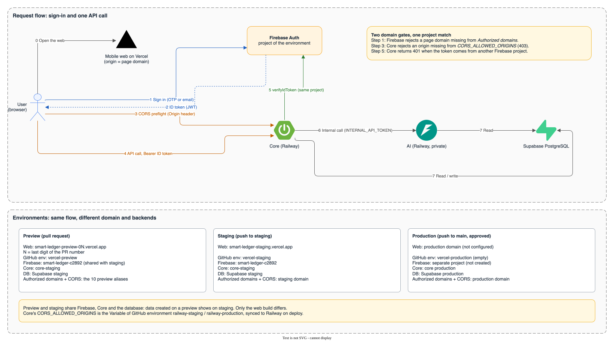

# CI/CD to Railway and Vercel

This document traces a change from a feature branch to Railway for `backend/core` and `backend/ai`, and to Vercel for the mobile web. Everything runs in [`.github/workflows/ci.yml`](../../.github/workflows/ci.yml), split into `###` sections: **Test**, **Report**, **Deploy backend** (job `deploy`, after every CI job passes) and **Deploy web** (job `deploy-web`, see [Mobile web on Vercel](#mobile-web-on-vercel)). Branch and review rules live in [CONTRIBUTING](../../CONTRIBUTING.md). The Android app is built by a separate manual workflow, [`mobile-release.yml`](../../.github/workflows/mobile-release.yml); see [Android build](#android-build).

## Overview



Diagram source: [`ci-cd.drawio`](../architecture/diagrams/src/ci-cd.drawio); edit it in draw.io, then re-export the SVG (`drawio -x -f svg -e --embed-svg-images --svg-theme light -b ffffff -o docs/architecture/diagrams/images/ci-cd.svg docs/architecture/diagrams/src/ci-cd.drawio`). Blue numbers are the deploy pipeline; orange numbers are the runtime request flow.

## Steps

1. **PR into `staging`:** CI runs the tests, checks migrations on a throwaway PostgreSQL and builds the images. Job `deploy` is skipped because the event is `pull_request`.
2. **Merge into `staging`:** CI runs again on the merged commit. When `ai`, `core`, `mobile-web` and `container-images` all pass, job `deploy` uses environment `railway-staging` and deploys to Railway staging. No approval is needed.
3. **PR `staging` → `main`:** open it only after checking staging (see [Target branch](../../CONTRIBUTING.md#target-branch)).
4. **Merge into `main`:** CI runs again; job `deploy` waits in *Waiting*. A reviewer opens the run in the Actions tab → **Review deployments** → Approve. Only then does the job receive the production `RAILWAY_TOKEN` and deploy.

Every CI job must pass before a deploy, including `mobile-web`. Each deploy uploads a `deploy-summary-<branch>` artifact (environment, commit, `ai`/`core` result) and a summary table on the run page.

## Configuration

### GitHub Environments

| Environment | Allowed branches | Approval | Secrets | Variables |
|---|---|---|---|---|
| `railway-staging` | `staging` | No | `RAILWAY_TOKEN`: project token of the Railway staging environment | `CORS_ALLOWED_ORIGINS` |
| `railway-production` | `main` | Yes | `RAILWAY_TOKEN`: project token of the Railway production environment | `CORS_ALLOWED_ORIGINS` (optional) |
| `vercel-preview` | Any branch (PR) | No | `VERCEL_TOKEN`, `VERCEL_ORG_ID`, `VERCEL_PROJECT_ID` | `EXPO_PUBLIC_*` |
| `vercel-staging` | `staging` | No | Same as above | `EXPO_PUBLIC_*`, `VERCEL_STAGING_ALIAS` |
| `vercel-production` | `main` | Yes | Same as above | `EXPO_PUBLIC_*` |
| `android-dev` | Any branch except `main` and `staging` | No | `ANDROID_GOOGLE_SERVICES_JSON`: Firebase config of the dev/staging project | `EXPO_PUBLIC_*` |
| `android-staging` | `staging` | No | `ANDROID_GOOGLE_SERVICES_JSON`: Firebase config of the staging project | `EXPO_PUBLIC_*` |
| `android-production` | `main` | Yes | `ANDROID_GOOGLE_SERVICES_JSON`: Firebase config of the production project | `EXPO_PUBLIC_*` |

Do not put backend secrets in the `vercel-*` environments.

Each Railway project token can deploy to exactly one Railway environment, so a job running with `railway-staging` cannot deploy to production.

### Railway

- One project with two environments, `staging` and `production`, each with services `core` and `ai`. Service names must match `--service` in the workflow.
- The workflow uploads code with `railway up backend/<service> --path-as-root`, so each service's **Root Directory** stays empty and GitHub auto-deploy stays **off** (otherwise every commit deploys twice).
- Service variables (database, Firebase, `INTERNAL_API_TOKEN`, model key…) are set on Railway per environment; GitHub keeps only the deploy token and `CORS_ALLOWED_ORIGINS`. Railway does not mount files, so Core receives the Firebase Admin key through `FIREBASE_SERVICE_ACCOUNT_JSON` (the full service-account JSON, one service account per environment); when it is empty, Core falls back to `GOOGLE_APPLICATION_CREDENTIALS` as in local runs.

### Railway service variables

Enter each value once and reuse it with a [reference variable](https://docs.railway.com/guides/variables#reference-variables), so Railway fills it in for the environment being deployed. Staging and production then share one configuration with different values, and rotating a secret touches one place.

**Shared Variables** (Project Settings → Shared Variables, set per environment):

| Variable | Value |
|---|---|
| `INTERNAL_API_TOKEN` | Random string, different for staging and production |

**Service `core`:**

| Variable | Value |
|---|---|
| `AI_BASE_URL` | `http://${{ai.RAILWAY_PRIVATE_DOMAIN}}:8001` |
| `INTERNAL_API_TOKEN` | `${{shared.INTERNAL_API_TOKEN}}` |
| `DATABASE_URL`, `DATABASE_USERNAME`, `DATABASE_PASSWORD` | Supabase of the matching environment (JDBC URL) |
| `FIREBASE_PROJECT_ID`, `FIREBASE_SERVICE_ACCOUNT_JSON` | Firebase project of the matching environment |
| `FLYWAY_ENABLED` | `false` |
| `CORS_ALLOWED_ORIGINS` | Managed from GitHub, see [Core CORS origins](#core-cors-origins). Do not edit it on Railway. |

**Service `ai`:**

| Variable | Value |
|---|---|
| `INTERNAL_API_TOKEN` | `${{shared.INTERNAL_API_TOKEN}}` |
| `POSTGRES_URL` | Supabase of the matching environment (`postgresql://…`) |
| `AI_SQL_READER_URL` | Read-only `ai_sql_reader` login (AI baseline in `supabase/migrations/`); when empty, the agent cannot read shop data |
| `REDIS_URL` | Redis Cloud of the matching environment |
| `OPENAI_API_KEY` | Model provider key |

- `ai` has no public domain; `core` calls it over the private network. Port `8001` is AI's default `SERVER_PORT`, not the `PORT` Railway assigns, so changing `SERVER_PORT` on `ai` requires updating `AI_BASE_URL`.
- Variables have local defaults (`AI_BASE_URL` defaults to `http://localhost:8001`), so a missing variable on Railway still reports a successful deploy while Core cannot reach AI. After changing variables, run one chat through Core on staging.
- Backend secrets live only on Railway. The mobile web Vercel project receives only `EXPO_PUBLIC_*`.

### Core CORS origins



Diagram source: [`auth-request-flow.drawio`](../architecture/diagrams/src/auth-request-flow.drawio), exported like the CI/CD diagram above. A browser request passes two domain gates, Firebase Authorized domains (step 1) and Core CORS (step 3), and Core accepts only ID tokens from its own Firebase project (step 5).

Core accepts browser calls only from the exact origins in `CORS_ALLOWED_ORIGINS`: comma-separated, `http(s)` only, no wildcard, path, trailing `/` or whitespace. Core **refuses to start** on any invalid entry, so a stray line break pasted on Railway takes staging down.

The value is kept in the **Variables** of GitHub environments `railway-staging` and `railway-production`. Before deploying Core, step `Sync core CORS origins` rejects whitespace or wildcards and writes the value to Railway service `core`. When the GitHub variable is unset, the step is skipped and the Railway value stays as is. A change takes effect on the next push to the branch, or by re-running the `deploy` job.

Staging value:

```text
https://smart-ledger-staging.vercel.app,https://smart-ledger-preview-00.vercel.app,…,https://smart-ledger-preview-09.vercel.app
```

The ten `smart-ledger-preview-0N` origins belong to pull-request previews (see below); the same domains must also be listed in Firebase Authorized domains for sign-in to work.

## What this flow does not do yet

- No database migrations. Flyway stays off by default and `supabase db push` is not in CI; the migration owner runs them by hand following [Database migrations](../../README.md#database-migrations), on staging before production.
- No path filtering: every push to `staging` or `main` redeploys both `ai` and `core`, even for a mobile-only change.
- Rollback: pick the previous deploy on the Railway dashboard → **Redeploy**; there is no automated step.

## Mobile web on Vercel

Job `deploy-web` builds `frontend/mobile` on the runner (`vercel build`) and uploads the build to Vercel (`vercel deploy --prebuilt`). Vercel does not build from Git (`git.deploymentEnabled: false` in `frontend/mobile/vercel.json`), so each commit deploys once and GitHub is the only place holding web configuration.

| Event | Environment | Result |
|---|---|---|
| PR (branch in this repo) | `vercel-preview` | Aliased to `smart-ledger-preview-0N.vercel.app`, where `N` is the last digit of the PR number; the bot comments the alias on the PR |
| Push `staging` | `vercel-staging` | Preview deploy, then aliased to `VERCEL_STAGING_ALIAS`; the GitHub Deployments link is `https://smart-ledger-staging.vercel.app` |
| Push `main` | `vercel-production` | Production deploy after approval; the smoke test and the GitHub Deployments link use `https://smart-ledger-prod.vercel.app` |

- The `url` of `vercel-staging` and `vercel-production` is set on job `deploy-web` in `ci.yml` and fixed to the two domains above, so the repository's Deployments panel links to them. `vercel-preview` has no `url`: its alias depends on the PR number and is already commented on the PR. If a domain changes in Vercel (Project → Settings → Domains), update `ci.yml` too.
- Only job `mobile-web` must pass; the web does not wait for the backend deploy.
- PRs from forks get no secrets, so they get no preview.
- `EXPO_PUBLIC_*` values are baked into the bundle at build time, so set them as **Variables** (not Secrets) of each environment: `EXPO_PUBLIC_USE_MOCK`, `EXPO_PUBLIC_MOCK_CORE`, `EXPO_PUBLIC_MOCK_SHOPS`, `EXPO_PUBLIC_API_ENDPOINT`, `EXPO_PUBLIC_FIREBASE_API_KEY`, `EXPO_PUBLIC_FIREBASE_AUTH_DOMAIN`, `EXPO_PUBLIC_FIREBASE_PROJECT_ID`, `EXPO_PUBLIC_FIREBASE_APP_ID`. Re-run the job after changing one so the web picks it up.
- An empty `EXPO_PUBLIC_USE_MOCK` runs the app on mocks (`src/config.ts` turns mocks off only for `false`).
- Calling the real Core from a browser needs the web origin in Core's [`CORS_ALLOWED_ORIGINS`](#core-cors-origins) and the web domain in Firebase Authorized domains. Each deploy URL carries a random hash and cannot be listed, so previews use ten fixed aliases, `smart-ledger-preview-00` … `-09`. Two open PRs sharing a last digit overwrite each other's alias; re-run the job to take the slot back.
- The smoke test fails the job when the deployed web would not reach Core: page not returning 200, API endpoint missing from the bundle, or Core rejecting the origin's CORS preflight. Mock builds skip the Core checks.
- `VERCEL_ORG_ID` and `VERCEL_PROJECT_ID` come from Vercel Project Settings → General; create `VERCEL_TOKEN` under Account Settings → Tokens, scoped to the project's team.

## Android build

[`mobile-release.yml`](../../.github/workflows/mobile-release.yml) builds the Android app only when someone starts it (`workflow_dispatch`); no push or pull request triggers it. It lives outside `ci.yml` so the Android toolchain is downloaded only when needed and a change here cannot affect the backend and web gates. The Expo cloud build (`eas build`) is not used because the free plan queues builds behind paid ones ([Expo build queues](https://github.com/expo/fyi/blob/main/eas-build-queues.md)).

### Run a build

Actions tab → **Mobile release** → **Run workflow**, choose the branch in *Use workflow from*, then the inputs; or `gh workflow run mobile-release.yml --ref <branch> -f environment=android-dev -f runner=auto`.

| Environment | Builds from | Output | ABIs |
|---|---|---|---|
| `android-dev` | Any branch except `main` and `staging`, including a pull request branch | APK | `arm64-v8a` |
| `android-staging` | `staging`, after a green CI run on the commit | APK | all four |
| `android-production` | `main`, after a green CI run and approval | AAB | all four |

Job `gate` rejects a wrong branch or a commit without a successful `ci.yml` run before any runner starts. Only people with write access can run a workflow, and forks cannot.

### Runners

Job `select-runner` resolves input `runner`:

| Input | Result |
|---|---|
| `github-hosted` | `ubuntu-24.04` |
| `self-hosted` | A machine labelled `android-build`; the job waits if none is free |
| `auto` | A free online `android-build` machine, otherwise `ubuntu-24.04` |

`auto` lists runners through the GitHub API, which the default `GITHUB_TOKEN` cannot do. Create a fine-grained token with repository permission **Administration: read** and store it as repository secret `RUNNERS_READ_TOKEN`; without it `auto` always falls back to GitHub-hosted, and the reason is written in the build summary.

A GitHub-hosted runner installs Node, JDK, SDK, NDK and Gradle with caching on every run. A self-hosted machine already holds them and its Gradle and npm caches, so the job only runs `.github/scripts/android-preflight.mjs`, which fails with a clear message when a version differs from the pinned block at the top of the workflow. It never downloads: pulling GitHub's cache or the roughly 1 GB NDK over a home connection is slower than the build.

To add a machine: install Node 22, JDK 17, and the Android SDK with platform 36, build-tools 36.0.0 and NDK 27.1.12297006; set `ANDROID_HOME`; register a runner (repository Settings → Actions → Runners) with the label `android-build`.

- Keep the repository's workflow triggers to `workflow_dispatch` and `push` on trusted branches for any job that can run on self-hosted; never `pull_request` from forks, because the job executes the branch's code on a teammate's machine.
- A self-hosted job runs whatever the chosen branch contains, so `android-dev` secrets must hold only dev-level values.
- Windows and Linux machines use the same label and script. Windows is untested: the C++ build of React Native's New Architecture can hit the 260-character path limit, so enable long paths and keep the runner's work folder short.

### Configuration

Each `android-*` environment needs:

- Secret `ANDROID_GOOGLE_SERVICES_JSON`: the content of `google-services.json` for that environment's Firebase project. The job writes it to a temp path and points `GOOGLE_SERVICES_JSON` at it, which [`app.config.js`](../../frontend/mobile/app.config.js) already reads.
- Variables `EXPO_PUBLIC_*`, the same list as [Mobile web on Vercel](#mobile-web-on-vercel).
- Deployment branches and approval as in the table under [GitHub Environments](#github-environments).

### Result

Every run uploads `android-build-summary-<environment>-<run number>` (`.md` and `.json`: runner and why it was chosen, commit, toolchain, time per phase, step outcomes, artifact size and SHA-256), also on failure, and the same table on the run page. A successful run also uploads `android-<environment>-<run number>`, the APK or AAB named `smart-ledger-<environment>-<branch>-<commit>`; artifacts are kept 14 days.

### Measured and not yet verified

- Measured on an Apple M4 Pro (12 cores) with a warm Gradle cache, 4 ABIs, a placeholder Firebase file: prebuild 1 s and `assembleRelease` 4 min 3 s. The first build on a machine was blocked for over 30 minutes downloading the NDK over a slow connection, and Gradle stalled with the default 2 GB heap and 512 MB Metaspace; the workflow passes `-Xmx6g -XX:MaxMetaspaceSize=1g`.
- Not yet run on GitHub: the workflow, the runner fallback and the hosted run time are untested. The roughly 12–20 minutes expected on `ubuntu-24.04` is an estimate.
- All builds are signed with the debug keystore that the Expo template uses for release builds, so the production AAB cannot be uploaded to Google Play yet. Release signing and the Play upload are not part of this workflow.
- iOS is not built here (see [mobile-ios-device-release.md](mobile-ios-device-release.md)).
